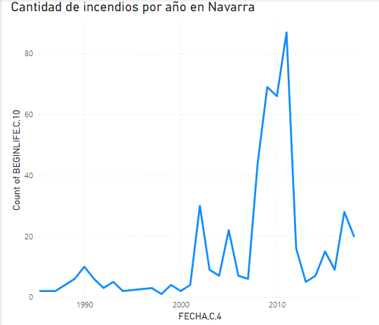
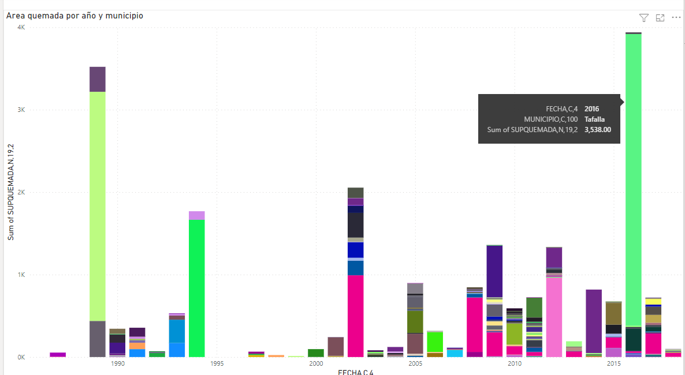
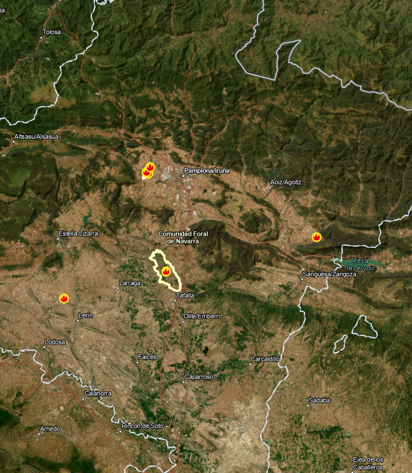
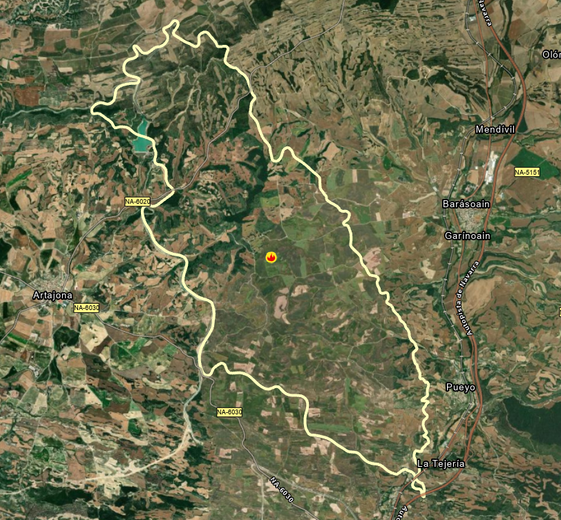
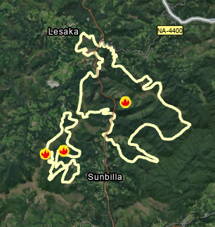
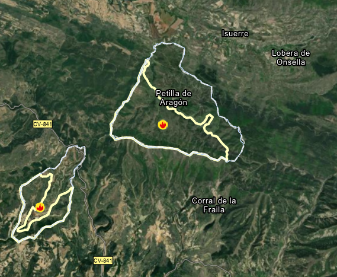
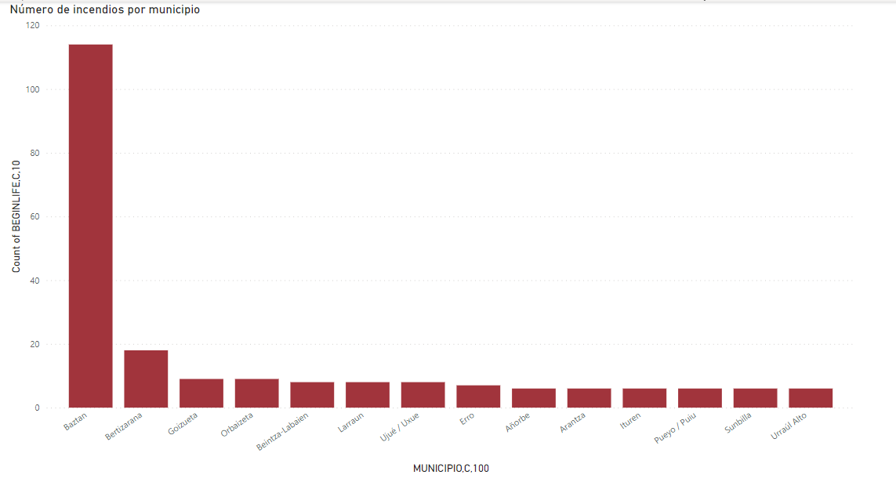
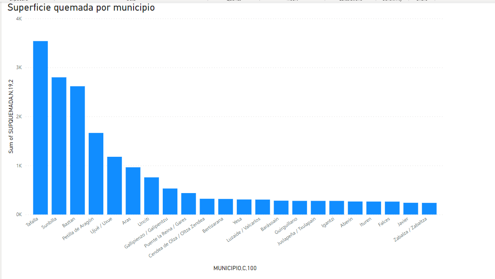

# PEC 3 - Visualización de datos


## Carlos Chamorro

### Historial de incendios en Navarra desde 1986 - 2019 

Para esta presentación en forma de storytelling he escogido el dataset FOREST_Pol_HCoIncendio a traves de la url "https://data.europa.eu/data/datasets/spasitnaforest_pol_hcoincendio-xml?locale=it"


```python
from IPython.display import Image
```




Podemos apreciar que 2011 es el año con un mayor número de incendios y, al mismo tiempo el lapso de tiempo entre 2008 a 2012, reflejan un mayor número de incendios en comparación con el resto de años.



Al observar el area quemada por año y municipio podemos apreciar los incendios más devastadores de los últimos 30 años en Navarra. El incendio mas grave se dio en 2016 en Tafalla. Para hacernos una idea de las dimensiones de este, lo visualizaremmos en el mapa





El segundo y tercer incendio más importantes de Navarra fueron Sunbilla, 1989, y Petilla de Aragón 1994





Como curiosidad, Petilla de Aragón queda aislada del resto de Navarra. Podemos ver que gran parte de este área se quemó.



Resultará interesante saber cuáles son los municipios con más incendios. En Navarra Baztan se lleva este dudoso honor



No obstante, al comparar la superficie quemada vemos que el impacto de los incendios de tafalla, Sumbilla y Petilla de Aragón han tenido un gran impacto.

Por último, observamos en forma de gif e historial de incendios sobre el mapa.


```python
from IPython.display import Video

Video("incendios.mp4")
```


<video src="incendios.mp4" controls  >
      Your browser does not support the <code>video</code> element.
    </video>


