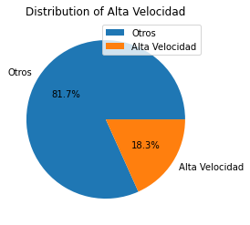

# Práctica 2: Visualización de datos

## Estudio del sistema ferroviario de media y larga en la península ibérica

Los datos se han obtenido de la dirección url: https://data.renfe.com/dataset/horarios-de-alta-velocidad-larga-distancia-y-media-distancia .
Se ha de tener en cuenta que, a pesar de ser datos oficiales ofrecidos por la propia Renfe, estos no muestran datos fiables, por lo que el uso de este set de datos se da con fines puramente académicos


```python
import pandas as pd
import matplotlib.pyplot as plt

calendar = pd.read_csv('calendar.txt')
calendar_dates = pd.read_csv('calendar_dates.txt')
stops = pd.read_csv('stops.txt')
stop_times = pd.read_csv('stop_times.txt')
trips = pd.read_csv('trips.txt') 
routes = pd.read_csv('routes.txt')

```


```python
total_amount = routes.shape[0]
total_amount
```


    599


Renfe mantiene un total de 599 líneas.


```python
route_count = routes.groupby(['route_short_name']).size().reset_index(name='counts')

colors = {'Intercity':'white', 'ALVIA':'gray', 'TORRE ORO':'gold', 'EUROMED':'blue', 'AVE':'MediumVioletRed',
         'AVLO':'green', 'AVANT':'orange', 'MD':'red', 'REGIONAL': 'crimson', 'REG.EXP.': 'purple', 'RODALIES':'salmon'  }
route_count['color'] = route_count['route_short_name'].apply(lambda x: colors[x])

route_count = route_count.sample(frac=1).reset_index(drop=True)


```

### Servicios de Renfe 


```python
Estudiamos la distribución de los servicios,a tenor de la cantidad de rutas que ofrece cada uno.
```


```python
fig, ax = plt.subplots(figsize=(8, 8)) # make the plot bigger
explode = [0.05 if val < route_count['counts'].mean() else 0 for val in route_count['counts']]
ax.pie(route_count['counts'], labels=route_count['route_short_name'], colors=route_count['color'], 
       autopct='%1.1f%%', startangle=90, textprops={'color':'black'}, explode=explode)

ax.set_title("Distribución de las rutas por srvicios", fontsize=20, color='black', y=1.08)

legend = ax.legend(route_count['route_short_name'], title="Servicio", 
                  bbox_to_anchor=(1.5, 0.5), loc="center left", fontsize=12)
legend.get_title().set_fontsize(14)

plt.show()
```


    

    


```python
trips.rename(columns = {'wheelchair_accessible                                                                                                                                                                                                                                                ':'wheelchair_accesible'}, inplace = True)
```


```python
trips.columns

```


    Index(['route_id', 'service_id', 'trip_id', 'trip_headsign', 'trip_short_name',
           'direction_id', 'block_id', 'shape_id', 'wheelchair_accesible'],
          dtype='object')


### 2. Accesibilidad 

Nos preguntamos por el estado de la accesibilidad para sillas de ruedas en el sistema ferroviario. En el siguiente gráfico observamos la distribución por servicio.


```python
merged_df = pd.merge(trips, routes, left_on='route_id', right_on='route_id')

grouped_df = merged_df.groupby(['route_short_name', 'wheelchair_accesible']).size().reset_index(name='counts')

grouped_df['wheelchair_accesible'] = grouped_df['wheelchair_accesible'].replace({1: 'adaptado', 2: 'no adaptado'})

grouped_df = grouped_df.groupby(['route_short_name']).apply(lambda x: x.assign(counts = x.counts/x.counts.sum()))

fig, ax = plt.subplots(figsize=(20,10))

pivot_df = grouped_df.pivot(index='route_short_name', columns='wheelchair_accesible', values='counts')
pivot_df.plot(kind='bar', stacked=True, color=['green', 'red'],ax=ax)

plt.xlabel("Route Short Name")
plt.legend(title="Adapted for wheelchairs", bbox_to_anchor=(1.05, 1), loc=2, borderaxespad=0.)
```


    <matplotlib.legend.Legend at 0x14c8bcb85e0>


    

    


Observamos en el mapa la localización de las paradas con accesibilidad.


Vemos que, a pesar de que muchos de los servicios ofrecen accesibilidad, la mayor parte de las paradas aún carecen de este tipo de ayuda al consumidor. También podemos observar que muchas de las paradas con acceso a sillas de ruedas se encuentran en centros poblacionales como capitales de provincia. Esto, a pesar de tener lógica, hace que el servicio público no sea una buena solución para personas con discapacidad en entornos rurales.

Vemos que la infraestructura de alta velocidad es más simple que el conjunto de la infraestructura total


```python
merged_1 = pd.merge(stop_times, stops, on='stop_id')

merged_2 = pd.merge(merged_1, trips, on='trip_id')

merged_df = pd.merge(merged_2, routes, on='route_id')
```


```python
merged_df.columns
```


    Index(['trip_id', 'arrival_time', 'departure_time', 'stop_id', 'stop_sequence',
           'stop_headsign', 'pickup_type', 'drop_off_type',
           'shape_dist_traveled                                                                                                                                                                                                                                         ',
           'stop_code', 'stop_name', 'stop_desc', 'stop_lat', 'stop_lon',
           'zone_id', 'stop_url', 'location_type', 'parent_station',
           'stop_timezone',
           'wheelchair_boarding                                                                                                                                                                                                                       ',
           'geometry', 'route_id', 'service_id', 'trip_headsign',
           'trip_short_name', 'direction_id', 'block_id', 'shape_id',
           'wheelchair_accesible', 'agency_id', 'route_short_name',
           'route_long_name', 'route_desc', 'route_type', 'route_url',
           'route_color',
           'route_text_color                                                                                                                                                                                                                                              '],
          dtype='object')


```python
merged_df = merged_df.drop(columns=['stop_headsign', 'pickup_type', 'drop_off_type', 'shape_dist_traveled                                                                                                                                                                                                                                         ', 'stop_code', 'shape_id', 'agency_id', 'route_long_name', 'route_type', 'route_url', 'route_color', 'route_text_color                                                                                                                                                                                                                                              ', 'trip_headsign', 'direction_id', 'block_id', 'stop_desc', 'zone_id', 'route_desc', 'stop_url', 'location_type', 'parent_station'])
```


```python
date = merged_df["trip_id"].str[-10:]

merged_df["arrival_date"] = date + " " + merged_df["arrival_time"]
merged_df["departure_date"] = date + " " + merged_df["departure_time"]

merged_df["arrival_date"] = pd.to_datetime(merged_df["arrival_date"], format="%Y-%m-%d %H:%M:%S", errors='coerce')
merged_df["departure_date"] = pd.to_datetime(merged_df["departure_date"], format="%Y-%m-%d %H:%M:%S", errors='coerce')

invalid_rows = pd.isnull(merged_df["arrival_date"]) | pd.isnull(merged_df["departure_date"])

merged_df.loc[invalid_rows, "arrival_date"] = merged_df.loc[invalid_rows, "arrival_date"] + pd.Timedelta(days=1) - pd.Timedelta(hours=24)
merged_df.loc[invalid_rows, "departure_date"] = merged_df.loc[invalid_rows, "departure_date"] + pd.Timedelta(days=1) - pd.Timedelta(hours=24)
```


```python
merged_df
```


<div>
<style scoped>
    .dataframe tbody tr th:only-of-type {
        vertical-align: middle;
    }

    .dataframe tbody tr th {
        vertical-align: top;
    }

    .dataframe thead th {
        text-align: right;
    }
</style>
<table border="1" class="dataframe">
  <thead>
    <tr style="text-align: right;">
      <th></th>
      <th>trip_id</th>
      <th>arrival_time</th>
      <th>departure_time</th>
      <th>stop_id</th>
      <th>stop_sequence</th>
      <th>stop_name</th>
      <th>stop_lat</th>
      <th>stop_lon</th>
      <th>stop_timezone</th>
      <th>wheelchair_boarding</th>
      <th>geometry</th>
      <th>route_id</th>
      <th>service_id</th>
      <th>trip_short_name</th>
      <th>wheelchair_accesible</th>
      <th>route_short_name</th>
      <th>arrival_date</th>
      <th>departure_date</th>
    </tr>
  </thead>
  <tbody>
    <tr>
      <th>0</th>
      <td>0016512022-12-13</td>
      <td>15:00:00</td>
      <td>15:00:00</td>
      <td>71801</td>
      <td>1</td>
      <td>Barcelona-Sants</td>
      <td>41.379220</td>
      <td>2.140624</td>
      <td>Europe/Madrid</td>
      <td>1</td>
      <td>POINT (2.14062 41.37922)</td>
      <td>7180161307GL026</td>
      <td>2022-12-132022-12-19001651</td>
      <td>165</td>
      <td>1</td>
      <td>Intercity</td>
      <td>2022-12-13 15:00:00</td>
      <td>2022-12-13 15:00:00</td>
    </tr>
    <tr>
      <th>1</th>
      <td>0016512022-12-13</td>
      <td>15:56:00</td>
      <td>15:58:00</td>
      <td>71500</td>
      <td>2</td>
      <td>Tarragona</td>
      <td>41.111624</td>
      <td>1.253214</td>
      <td>Europe/Madrid</td>
      <td>1</td>
      <td>POINT (1.25321 41.11162)</td>
      <td>7180161307GL026</td>
      <td>2022-12-132022-12-19001651</td>
      <td>165</td>
      <td>1</td>
      <td>Intercity</td>
      <td>2022-12-13 15:56:00</td>
      <td>2022-12-13 15:58:00</td>
    </tr>
    <tr>
      <th>2</th>
      <td>0016512022-12-13</td>
      <td>16:14:00</td>
      <td>16:15:00</td>
      <td>65422</td>
      <td>3</td>
      <td>CAMBRILS</td>
      <td>41.081648</td>
      <td>1.046055</td>
      <td>Europe/Madrid</td>
      <td>2</td>
      <td>POINT (1.04605 41.08165)</td>
      <td>7180161307GL026</td>
      <td>2022-12-132022-12-19001651</td>
      <td>165</td>
      <td>1</td>
      <td>Intercity</td>
      <td>2022-12-13 16:14:00</td>
      <td>2022-12-13 16:15:00</td>
    </tr>
    <tr>
      <th>3</th>
      <td>0016512022-12-13</td>
      <td>16:35:00</td>
      <td>16:37:00</td>
      <td>65402</td>
      <td>4</td>
      <td>Laldea-Amposta-Tortosa</td>
      <td>40.753542</td>
      <td>0.614314</td>
      <td>Europe/Madrid</td>
      <td>1</td>
      <td>POINT (0.61431 40.75354)</td>
      <td>7180161307GL026</td>
      <td>2022-12-132022-12-19001651</td>
      <td>165</td>
      <td>1</td>
      <td>Intercity</td>
      <td>2022-12-13 16:35:00</td>
      <td>2022-12-13 16:37:00</td>
    </tr>
    <tr>
      <th>4</th>
      <td>0016512022-12-13</td>
      <td>16:52:00</td>
      <td>16:54:00</td>
      <td>65312</td>
      <td>5</td>
      <td>Vinaros</td>
      <td>40.471682</td>
      <td>0.455727</td>
      <td>Europe/Madrid</td>
      <td>1</td>
      <td>POINT (0.45573 40.47168)</td>
      <td>7180161307GL026</td>
      <td>2022-12-132022-12-19001651</td>
      <td>165</td>
      <td>1</td>
      <td>Intercity</td>
      <td>2022-12-13 16:52:00</td>
      <td>2022-12-13 16:54:00</td>
    </tr>
    <tr>
      <th>...</th>
      <td>...</td>
      <td>...</td>
      <td>...</td>
      <td>...</td>
      <td>...</td>
      <td>...</td>
      <td>...</td>
      <td>...</td>
      <td>...</td>
      <td>...</td>
      <td>...</td>
      <td>...</td>
      <td>...</td>
      <td>...</td>
      <td>...</td>
      <td>...</td>
      <td>...</td>
      <td>...</td>
    </tr>
    <tr>
      <th>56712</th>
      <td>1712112023-03-21</td>
      <td>7:10:00</td>
      <td>7:10:00</td>
      <td>12011</td>
      <td>5</td>
      <td>Los Angeles de San Rafael</td>
      <td>40.777909</td>
      <td>-4.206933</td>
      <td>Europe/Madrid</td>
      <td>2</td>
      <td>POINT (-4.20693 40.77791)</td>
      <td>1200612100VRR</td>
      <td>2023-03-212023-03-31171211</td>
      <td>17121</td>
      <td>1</td>
      <td>REGIONAL</td>
      <td>2023-03-21 07:10:00</td>
      <td>2023-03-21 07:10:00</td>
    </tr>
    <tr>
      <th>56713</th>
      <td>1712112023-03-21</td>
      <td>7:04:00</td>
      <td>7:04:00</td>
      <td>12010</td>
      <td>4</td>
      <td>El Espinar</td>
      <td>40.740852</td>
      <td>-4.189482</td>
      <td>Europe/Madrid</td>
      <td>2</td>
      <td>POINT (-4.18948 40.74085)</td>
      <td>1200612100VRR</td>
      <td>2023-03-212023-03-31171211</td>
      <td>17121</td>
      <td>1</td>
      <td>REGIONAL</td>
      <td>2023-03-21 07:04:00</td>
      <td>2023-03-21 07:04:00</td>
    </tr>
    <tr>
      <th>56714</th>
      <td>1712112023-03-21</td>
      <td>7:00:00</td>
      <td>7:00:00</td>
      <td>12009</td>
      <td>3</td>
      <td>San Rafael</td>
      <td>40.714944</td>
      <td>-4.181430</td>
      <td>Europe/Madrid</td>
      <td>2</td>
      <td>POINT (-4.18143 40.71494)</td>
      <td>1200612100VRR</td>
      <td>2023-03-212023-03-31171211</td>
      <td>17121</td>
      <td>1</td>
      <td>REGIONAL</td>
      <td>2023-03-21 07:00:00</td>
      <td>2023-03-21 07:00:00</td>
    </tr>
    <tr>
      <th>56715</th>
      <td>1712112023-03-21</td>
      <td>6:54:00</td>
      <td>6:54:00</td>
      <td>12007</td>
      <td>2</td>
      <td>Tablada</td>
      <td>40.705648</td>
      <td>-4.125310</td>
      <td>Europe/Madrid</td>
      <td>2</td>
      <td>POINT (-4.12531 40.70565)</td>
      <td>1200612100VRR</td>
      <td>2023-03-212023-03-31171211</td>
      <td>17121</td>
      <td>1</td>
      <td>REGIONAL</td>
      <td>2023-03-21 06:54:00</td>
      <td>2023-03-21 06:54:00</td>
    </tr>
    <tr>
      <th>56716</th>
      <td>1712112023-03-21</td>
      <td>6:48:00</td>
      <td>6:48:00</td>
      <td>12006</td>
      <td>1</td>
      <td>Cercedilla</td>
      <td>40.737528</td>
      <td>-4.066450</td>
      <td>Europe/Madrid</td>
      <td>2</td>
      <td>POINT (-4.06645 40.73753)</td>
      <td>1200612100VRR</td>
      <td>2023-03-212023-03-31171211</td>
      <td>17121</td>
      <td>1</td>
      <td>REGIONAL</td>
      <td>2023-03-21 06:48:00</td>
      <td>2023-03-21 06:48:00</td>
    </tr>
  </tbody>
</table>
<p>56717 rows × 18 columns</p>
</div>


```python
merged_df.to_csv('merged_data_2.csv', index=False)
```

### Distribución de los servicios en el mapa


Para comprender mejor la complejidad de los servicios ferroviarios, estudiaremos por separado los servicios de alta velocidad de los demás.

### Alta velocidad


```python
merged_df["alta_velocidad"] = merged_df["route_short_name"].map({"AVE":1, "AVLO":1}).fillna(0)
```


```python
merged_df["alta_velocidad"].replace({1: "Alta Velocidad", 0: "Otros"}, inplace=True)

counts = merged_df["alta_velocidad"].value_counts()

plt.pie(counts, labels=counts.index, autopct='%1.1f%%')
plt.title("Distribution of Alta Velocidad")
plt.legend()
plt.show()
```


    

    


Vemos que, en efecto, los servicios de alta velocidad representan menos de una quinta parte de los servicios otorgados por Renfe.

Observamos a continucación los movimientos de los trenes a través del tiempo durante la semana de navidad


```python
from IPython.display import Video

Video("alta_velocidad.mp4")
```


<video src="alta_velocidad.mp4" controls  >
      Your browser does not support the <code>video</code> element.
    </video>


### Otros servicios

Los servicios de media y larga distnacia que no usan infrestructura de alta velocidad suponen más del 80% del total.


Aquí podemos ver, además, como se distribuyen dichos servicios en la península.


```python
Video("otros_servicios.mp4")
```


<video src="otros_servicios.mp4" controls  >
      Your browser does not support the <code>video</code> element.
    </video>


En este clip podemos apreciar la complejidad del sistema durante la semana de navidad del 2022.


```python
!pip install nbstripout
nbconvert --to html --no-input --no-prompt visualizacion.ipynb
```


      File "C:\Users\Carlos\AppData\Local\Temp/ipykernel_9256/3487785396.py", line 2
        nbconvert --to html --no-input --no-prompt visualizacion.ipynb
                       ^
    SyntaxError: invalid syntax
    

